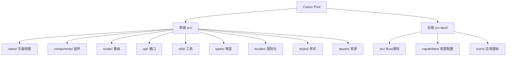

# Cursor Pool

Cursor Pool 是一个免费开源的桌面应用程序，基于 Tauri + Vue3 + TypeScript 开发，专为优化 Cursor 编辑器账户使用体验而设计。

## 项目简介

Cursor Pool 让您轻松管理多个 Cursor 账户，实现一键切换账户和重置机器码，有效解决 Cursor 编辑器使用中的各种限制问题。软件还提供详细的使用量统计，帮助您监控高级模型和低级模型的使用情况。

### 主要功能

- 多账户管理：快速切换不同的 Cursor 账户
- 机器码重置：一键重置机器码，解决使用限制
- 使用量统计：监控 AI 模型使用量和账户状态
- 界面定制：支持深色/浅色主题和多语言切换

## 技术架构

项目采用现代化的技术栈，包括：

- 前端：Vue 3 + TypeScript + Vite
- 后端：Tauri (Rust)
- UI框架：Naive UI
- 状态管理：Pinia
- 路由：Vue Router
- 国际化：vue-i18n

### 项目结构



## 开发环境搭建

### 前置要求

- Node.js 16+
- Rust 1.70+
- pnpm

### 安装步骤

1. 克隆项目

```bash
git clone https://github.com/yourusername/cursor-pool.git
cd cursor-pool
```

2. 安装依赖

```bash
pnpm install
```

3. 启动开发服务器

```bash
pnpm tauri dev
```

4. 构建应用

```bash
pnpm tauri build
```

## 目录结构说明

```
cursor-pool/
├── src/                    # 前端源码
│   ├── api/               # API 接口
│   ├── assets/            # 静态资源
│   ├── components/        # 公共组件
│   ├── composables/       # 组合式函数
│   ├── layouts/           # 布局组件
│   ├── locales/           # 国际化文件
│   ├── router/            # 路由配置
│   ├── styles/            # 全局样式
│   ├── types/             # 类型定义
│   ├── utils/             # 工具函数
│   └── views/             # 页面视图
├── src-tauri/             # Tauri 后端
│   ├── src/              # Rust 源码
│   ├── capabilities/     # 权限配置
│   └── icons/            # 应用图标
└── public/                # 静态资源
```

## 许可证

[MIT License](LICENSE)
